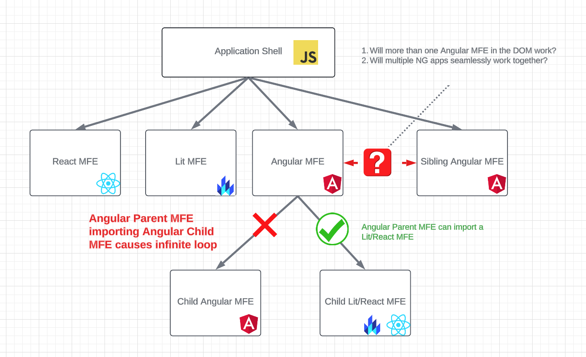

# About



## Up and Running

Start all non-ng apps from top level directory:

```shell
npm i && npm run dev
```

For ng apps, start each app individually:

Parent NG app:
```shell
cd packages/mfe5 && npm i && npm run start
```

Child NG app:
```shell
cd packages/ng-child && npm i && npm run start
```

Then navigate to http://localhost:8000 for app shell

Or to 4202 for the child ng app and 4201 for the parent ng app

-------------------


This repo contains an App Shell called 'shell' and two micro frontends; 'react-mfe' and 'lit-mfe'

The App Shell is built with vanilla javascript and Federation Runtime.

The App Shell uses Federation Runtime to consume react-mfe and lit-mfe. (shell/bootstrap.ts)

## MFE API

Each MFE exposes the same MFE API. (MFE.ts)

The standardized MFE API contains methods for mounting, bootstrapping, and destroying an MFE. (MFE.ts)

```typescript
export interface MFE {
    name: string,
    element: Element;
    mount: (anchor: Element, data: any) => void;
    bootstrap: (anchor: Element, data: any) => void;
    destroy: () => void;
}
```

The Application shell calls these methods on MFE modules during the user journey to switch between MFEs as necessary. (shell/bootstrap.ts)

```typescript
mfes.forEach(({ MFE }) => {
    const rootElement = prepareRoot(MFE.name);
    MFE.bootstrap(rootElement, { data: 'my data' });
});
```

## Up and Running

### Install Dependencies

From project root:

```shell
$ npm i
```

### Start Development Servers

From project root:

```shell
$ npm run dev
```

Or from package root:

```shell
$ cd packages/$PACKAGE_NAME && npm run dev
```
